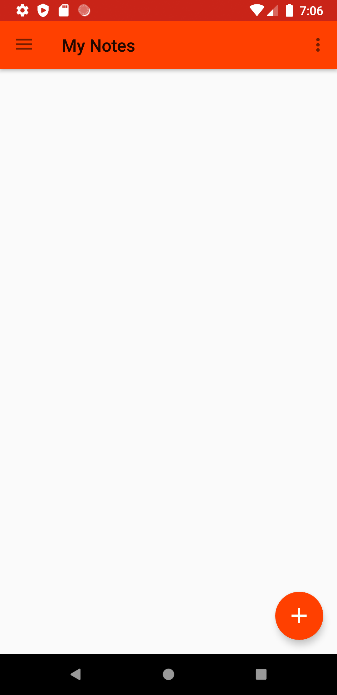
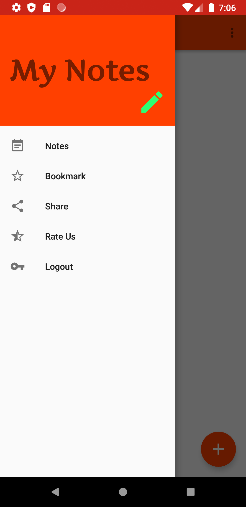
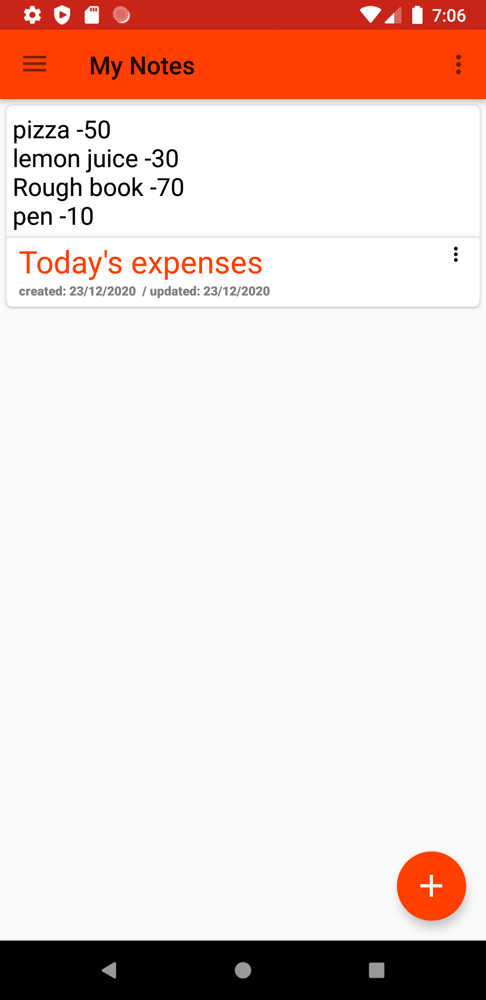
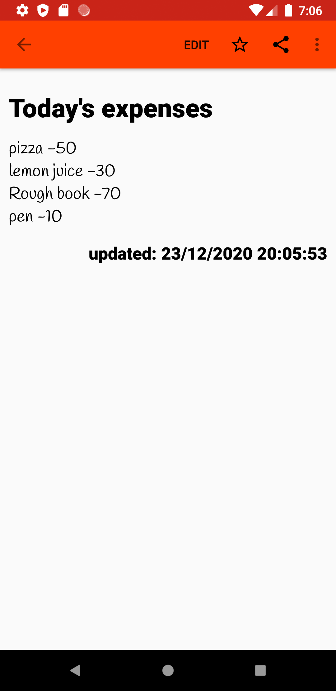
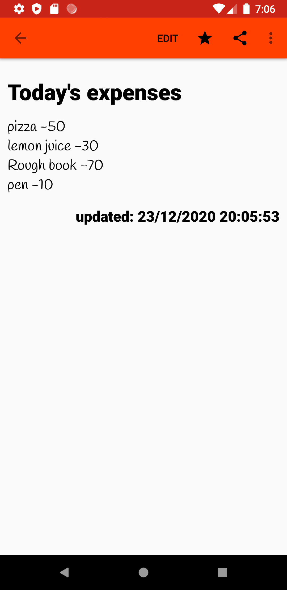
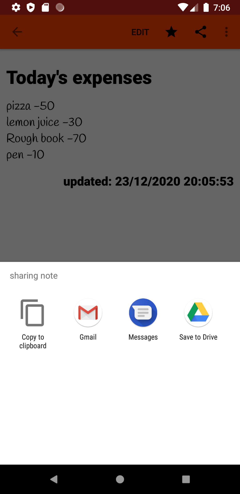
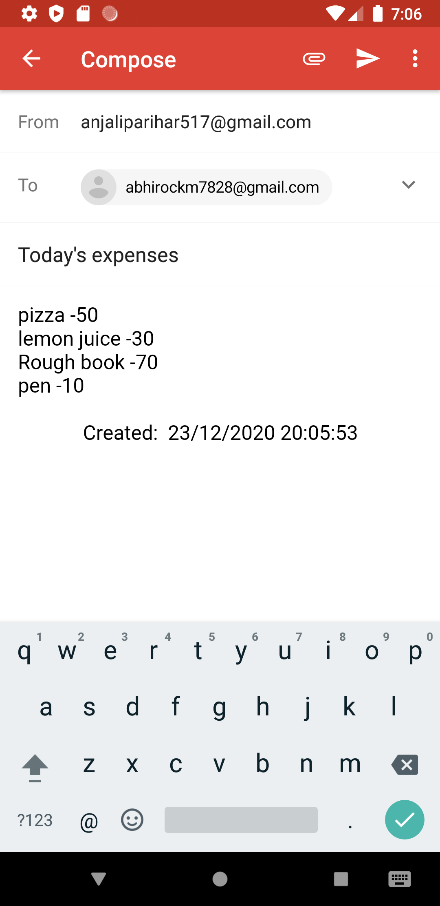
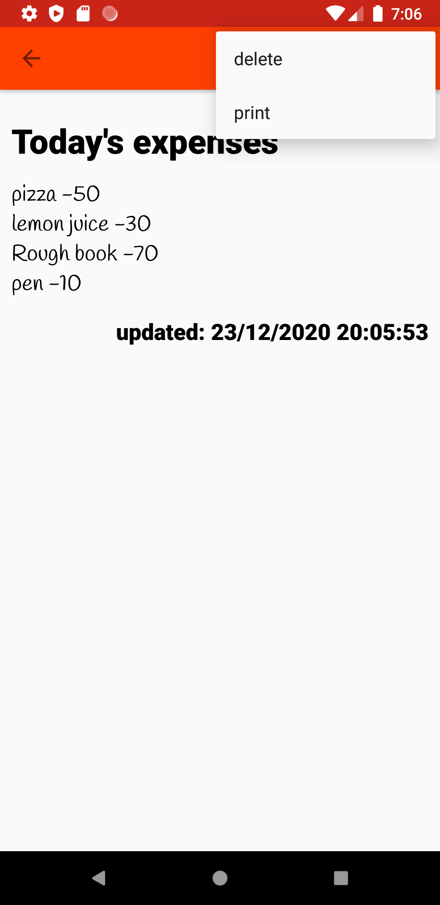

# Android Notes Application

An Android Application to 
CREATE 
UPDATE
DELETE
AND LIST THE NOTES.

 Screenshots










### Sample video
#### https://drive.google.com/file/d/1wRJw5WjnKdQlGm9Yw5aLqVFDx1-gjyZ-/view?usp=sharing

## Installation
Clone this repository and import into **Android Studio**
```bash
git clone https://github.com/anjali-123535/Notes
```

## Features

1. Create a note
2. Update a note
3. Get the list of all the notes
4. Remove the note if needed
5. Bookmark the important note
6. Share the note with your friends


## Generating signed APK

From Android Studio:
1. ***Build*** menu
2. ***Generate Signed APK...***
3. Fill in the keystore information *(you only need to do this once manually and then let Android Studio remember it)*

## Resources-
RecyclerView-
#### https://developer.android.com/guide/topics/ui/layout/recyclerview
CardView-
#### https://developer.android.com/guide/topics/ui/layout/cardview
Cloud FireStore-
#### https://firebase.google.com/docs/firestore/quickstart
